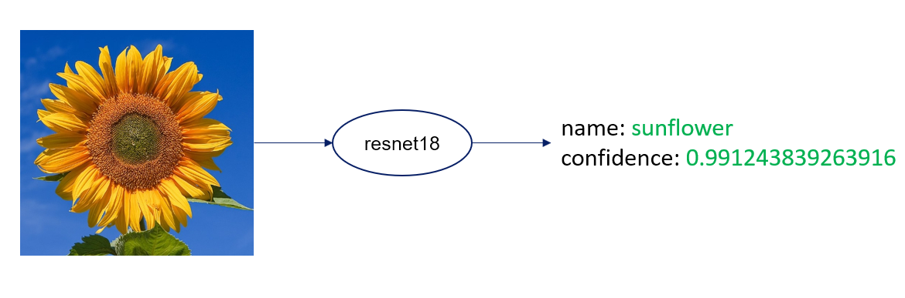

# train resnet18 for flower classification

## install & run
```bash
# install libs
pip install -r requirements.txt

# train
# flower102 dataset will be downloaded autoly
# resnet18.pth will be saved on disk
python train.py

# inference
python infer.py --image datas/test.png --weights resnet18.pth

```
## train flow

detals for training
1. download ```flower102``` data by pytorch's **datasets** class and split to `train`,`val` and `test` sets.
2. use pytorch `transform` tool for data augmentation
```python
    transform=transforms.Compose([
        transforms.Resize(256),
        transforms.CenterCrop(224),
        transforms.ToTensor(),
        transforms.Normalize([0.485, 0.456, 0.406],
                              [0.229, 0.224, 0.225])
    ])
```
3. shuffle and create batch by pytorch `DataLoader` class
4. train on built-in resnet18 network
```python
# change fc layer output size to 102
model.fc = nn.Linear(model.fc.in_features, 102)
# use Adam and CrossEntropyLoss algorithm for training
loss_fn = nn.CrossEntropyLoss()
optimizer = optim.Adam(model.fc.parameters(), lr=0.001)

```
5. save weights and model structure on disk
```python
torch.save(model, 'resnet18.pth')
```
## inference flow
